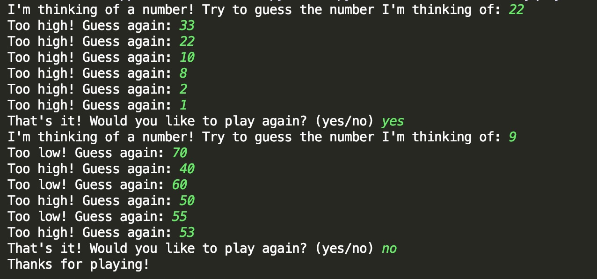

# 《Python编程从入门到实战》

**Python Crash Course** <br> A Hands-On, Project-Based Introduction to Programming

【美】**Eric Matthes** 著 **袁国中** 译

[图灵社区](http://www.ituring.com.cn/) 、 [Python 主页](http://python.org/)

[练习答案、源代码文件、安装说明、配套资源翻译等在页面右侧](http://www.ituring.com.cn/book/1861)


## 阅读情况

**第一部分 基础知识**

章         | 日期
:---------|:----------
[第1章 起步](01-install.md) |
第2章 变量和简单数据类型 |
第3章 列表简介 |
第4章 操作列表 |
第5章 if 语句 |
第6章 字典 |
第7章 用户输入和 while 循环 |
第8章 函数 | 2019.06.27

## 我写的前言中的程序

```py
import random


def guess_num_game():
    """猜词游戏"""
    msg_start = "I'm thinking of a number! " \
                "Try to guess the number I'm thinking of: "
    msg_gt = "Too high! Guess again: "
    msg_lt = "Too low! Guess again: "
    msg_eq = "That's it! Would you like to play again? (yes/no) "
    msg_thx = "Thanks for playing!"
    num = random.randint(0, 100)
    guess_num = int(input(msg_start))
    while True:
        if guess_num > num:
            guess_num = int(input(msg_gt))
        elif guess_num < num:
            guess_num = int(input(msg_lt))
        else:
            if input(msg_eq) == 'yes':
                num = random.randint(0, 100)
                guess_num = int(input(msg_start))
            else:
                break
    print(msg_thx)


def main():
    guess_num_game()


if __name__ == '__main__':
    main()

```
