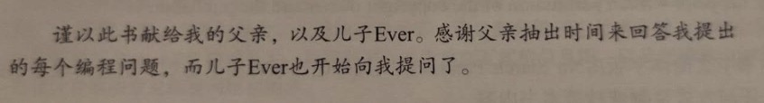

# 《Python编程从入门到实战》笔记

**Python Crash Course** A Hands-On, Project-Based Introduction to Programming

【美】**Eric Matthes** 著 **袁国中** 译

## [在线笔记](https://9527q.github.io/python-crash-course-note/)

## 目录

[猜词游戏代码](code/guess_number.py)

### 第一部分 基础知识

- [第 1 章 起步](./md-note/part1/01-start.md)
- [第 2 章 变量和简单数据类型](md-note/part1/02-type.md)
- [第 3 章 列表简介](md-note/part1/03-list.md)
- [第 4 章 操作列表](md-note/part1/04-operate_list.md)
- [第 5 章 if 语句](md-note/part1/05-if.md)

## 相关链接

- [图灵社区](http://www.ituring.com.cn/)
- [Python 主页](http://python.org/)
- [练习答案、源代码文件、安装说明、配套资源翻译等在链接页面右侧](http://www.ituring.com.cn/book/1861)
